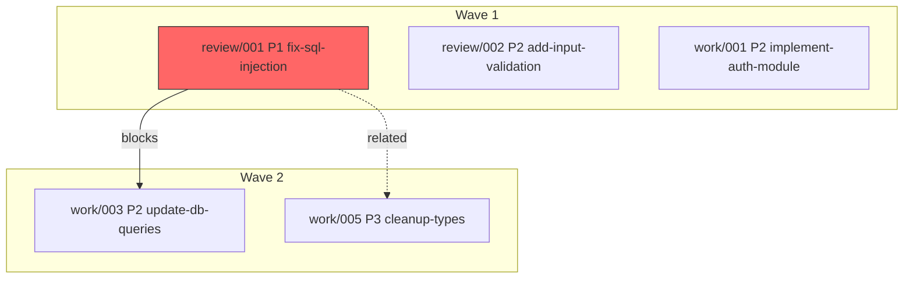

# Sub-Command Implementation Details

Detailed implementation reference for file-todos sub-commands. The SKILL.md contains the summary and dispatch logic; this file provides the full implementation details.

## Session Context Resolution

All `manifest` and `file-todos` subcommands require session context. Since todos are session-scoped (no project-root `todos/`), subcommands resolve the target `todos_base` via:

```javascript
/**
 * Resolve the todos_base for the current session context.
 * Used by standalone /rune:file-todos invocations (not workflow context).
 * In workflow context (strive, appraise, mend, arc), todos_base is passed directly.
 *
 * @param {string} args - Raw $ARGUMENTS string
 * @returns {string} Resolved todos_base path
 */
function resolveSessionContext(args: string): string {
  // 1. Explicit --session flag: /rune:file-todos list --session tmp/work/1771991022/
  const sessionFlag = args.match(/--session\s+([^\s]+)/)
  if (sessionFlag) {
    const dir = sessionFlag[1]
    return resolveTodosBase(dir)  // validates path safety
  }

  // 2. Auto-detect: find most recent active workflow from state files
  const stateFiles = Glob("tmp/.rune-{work,review,audit,mend}-*.json")
  const activeStates = stateFiles
    .map(f => { try { return JSON.parse(Read(f)) } catch { return null } })
    .filter(s => s && s.status === "active" && s.todos_base)
    .sort((a, b) => new Date(b.started) - new Date(a.started))

  if (activeStates.length > 0) return activeStates[0].todos_base

  // 3. Fallback: list recent completed sessions for user selection
  const completedStates = stateFiles
    .map(f => { try { return JSON.parse(Read(f)) } catch { return null } })
    .filter(s => s && s.todos_base)
    .sort((a, b) => new Date(b.started) - new Date(a.started))
    .slice(0, 5)

  if (completedStates.length > 0) {
    return AskUserQuestion({ /* session selection prompt with completedStates */ })
  }

  throw new Error("No session context found. Use --session <path> or run a workflow first.")
}
```

**In workflow context** (strive, appraise, mend, arc): session context is implicit — the orchestrator passes `todos_base` directly. The `resolveSessionContext()` flow is only used by standalone `/rune:file-todos` invocations.

## Validation Patterns

All user-supplied filter values MUST be validated before use:

```
STATUS_PATTERN  = /^(pending|ready|in_progress|complete|blocked|wont_fix|interrupted)$/
PRIORITY_PATTERN = /^p[1-3]$/
SOURCE_PATTERN  = /^(review|work|pr-comment|tech-debt|audit)$/
TAG_PATTERN     = /^[a-zA-Z0-9_-]+$/
TODO_ID_PATTERN = /^[0-9]{3,4}$/
```

Invalid values produce a clear error message, NOT an empty list.

Note: `interrupted` is a valid status (session ended before completion). `wont_fix` is both a status value AND a resolution outcome — see [lifecycle.md](lifecycle.md) for the dual-role semantics.

## Common Helpers

**parseFrontmatter(content)**: Extract YAML frontmatter from todo file content. Returns object with all frontmatter fields. Matches `^---\n([\s\S]*?)\n---` at the start of the file. Returns defaults for missing v2 fields (backward-compatible).

**readTodoDir(todosBase)**: Scan all source subdirectories for todo files. Returns list of `{ path, source, frontmatter, title }` objects. Uses zsh-safe glob `(N)` qualifier:

```bash
# Scan all source subdirectories (work/, review/, audit/)
# Support both 3-digit (001-999) and 4-digit (0001-9999) IDs
setopt nullglob
for f in "${todos_base}"/*/[0-9][0-9][0-9]-*.md(N) \
         "${todos_base}"/*/[0-9][0-9][0-9][0-9]-*.md(N); do
  # parse frontmatter from each file
  # derive source from parent directory name: source=$(basename "$(dirname "$f")")
done
```

**ensureTodosDir(todosBase, source)**: Create source subdirectory if it does not exist:

```javascript
function ensureTodosDir(todosBase: string, source: string): void {
  // SEC: Validate source against allowlist before shell interpolation
  const SOURCE_PATTERN = /^(review|work|pr-comment|tech-debt|audit)$/
  if (!SOURCE_PATTERN.test(source)) throw new Error('Invalid todo source: ' + source)
  Bash(`mkdir -p "${todosBase}/${source}"`)
}
```

**getTitle(content)**: Extract the first H1 heading from the markdown body (after frontmatter).

**markSourceDirty(todosBase, source)**: Touch the per-source dirty signal:

```javascript
function markSourceDirty(todosBase: string, source: string): void {
  Bash(`touch "${todosBase}/${source}/.dirty"`)
}
```

## create — Full Implementation

Interactive workflow for creating a new todo file.

1. Prompt user for todo details via AskUserQuestion (source determines subdirectory):
2. Ensure source subdirectory exists: `mkdir -p ${todosBase}/${source}/`

```javascript
AskUserQuestion({
  questions: [
    {
      question: "Todo title (brief description of the issue or task)",
      header: "Title"
    },
    {
      question: "Priority level",
      header: "Priority",
      options: [
        { label: "P1 — Critical", description: "Blocking issue, security vulnerability, data loss risk" },
        { label: "P2 — Important", description: "Significant bug, performance issue, missing feature" },
        { label: "P3 — Nice to have", description: "Cosmetic issue, minor improvement, tech debt" }
      ],
      multiSelect: false
    },
    {
      question: "Source of this todo",
      header: "Source",
      options: [
        { label: "review", description: "From code review TOME finding" },
        { label: "work", description: "From implementation plan task" },
        { label: "pr-comment", description: "From PR comment" },
        { label: "tech-debt", description: "Technical debt observation" },
        { label: "audit", description: "From audit TOME finding" }
      ],
      multiSelect: false
    },
    {
      question: "Affected files (comma-separated paths, or leave empty)",
      header: "Files"
    }
  ]
})
```

3. Generate next sequential ID (per-subdirectory sequence):

```bash
# ID sequence is independent per source subdirectory
# Support >999 todos with 4-digit IDs
setopt nullglob
existing_3=("${todos_base}/${source}"/[0-9][0-9][0-9]-*.md(N))
existing_4=("${todos_base}/${source}"/[0-9][0-9][0-9][0-9]-*.md(N))
total=$(( ${#existing_3[@]} + ${#existing_4[@]} + 1 ))
if (( total > 999 )); then
  next_id=$(printf "%04d" $total)
else
  next_id=$(printf "%03d" $total)
fi
```

4. Compute slug from title using the canonical slugify algorithm
5. Write file to source subdirectory using the todo template
6. Set frontmatter fields: `status: pending`, `priority`, `source`, `files`, `created`, `updated` (today's date)
7. Mark source dirty: `touch "${todos_base}/${source}/.dirty"`
8. Report: "Created `${todos_base}/${source}/{filename}`"

**Zero-state**: If `${todos_base}/${source}/` does not exist, create it automatically and report the creation.

## triage — Triage v2 Full Implementation

Process pending todos in batch (capped at 10 per session). Supports resolution-aware decisions in v2.

1. Scan all source subdirectories: `Glob("${todosBase}/*/[0-9][0-9][0-9]-*.md")`
2. Filter to `status: pending` (from frontmatter, NOT filename)
3. Sort by priority (P1 first), then by `issue_id` (oldest first)
4. If `talisman.file_todos.triage.auto_approve_p1 === true`:
   - Auto-approve all P1 pending todos (set `status: ready`, update `updated` date, append Status History)
   - Report auto-approved count separately
5. Cap remaining items at 10
6. For each pending todo, present via AskUserQuestion (v2 resolution-aware options):

```javascript
AskUserQuestion({
  questions: [{
    question: `Todo #${fm.issue_id} [${fm.priority}] -- ${title}\nSource: ${fm.source} | Files: ${fm.files.length} | Created: ${fm.created}`,
    header: "Triage Decision",
    options: [
      { label: "Approve", description: "Move to ready -- available for work" },
      { label: "Defer", description: "Keep pending -- revisit later" },
      { label: "False Positive", description: "Mark as false positive with reason" },
      { label: "Duplicate", description: "Mark as duplicate of another todo" },
      { label: "Out of Scope", description: "Not relevant to current task/sprint" },
      { label: "Superseded", description: "Replaced by a newer, broader todo" }
    ],
    multiSelect: false
  }]
})
```

7. Apply each decision:
   - **Approve**: Edit frontmatter `status: ready`, update `updated`, append Status History `pending→ready | user | Triage approved`
   - **Defer**: No changes
   - **False Positive**: Prompt for reason via `AskUserQuestion` (free text). Set `resolution: false_positive`, `resolution_reason`, `resolved_by: user`, `resolved_at`, `status: wont_fix`. Append Status History.
   - **Duplicate**: Show list of similar todos. User selects original. Set `resolution: duplicate`, `duplicate_of`, `resolution_reason`, `status: wont_fix`. Add `related_todos` backlink to original. Append Status History.
   - **Out of Scope**: Prompt for reason. Set `resolution: out_of_scope`, `resolution_reason`, `resolved_by: user`, `resolved_at`, `status: wont_fix`. Append Status History.
   - **Superseded**: Prompt for reason. Set `resolution: superseded`, `resolution_reason`, `resolved_by: user`, `resolved_at`, `status: wont_fix`. Append Status History.

8. Mark source dirty for manifest rebuild: `touch "${todosBase}/${source}/.dirty"`

9. Report summary (plain text, no emoji):

```
Triage Complete
------------------------------
 Approved:      4 (moved to ready)
 Deferred:      2 (kept pending)
 False Positive: 1 (marked wont_fix)
 Duplicate:      1 (marked wont_fix)
 Out of Scope:   0
 Superseded:     0
------------------------------
 Remaining pending: 3
```

**Zero-state**: "No pending todos found. All items have been triaged."

## list — Full Implementation

List todos with optional filters composing as intersection.

1. Parse filter flags from arguments:
   - `--status=VALUE` — validate against `STATUS_PATTERN`
   - `--priority=VALUE` — validate against `PRIORITY_PATTERN`
   - `--source=VALUE` — validate against `SOURCE_PATTERN`
   - `--tags=VALUE[,VALUE]` — validate each tag against `TAG_PATTERN`

2. If any filter value is invalid, report a clear error:
   ```
   Invalid filter: --priority=P5
   Valid values: p1, p2, p3
   ```
   Do NOT return an empty list for invalid filters.

3. Scan source subdirectories. When `--source` is specified, narrow to that source only:
   ```bash
   setopt nullglob
   Glob("${todosBase}/${sourceFilter}/[0-9][0-9][0-9]-*.md")
   Glob("${todosBase}/${sourceFilter}/[0-9][0-9][0-9][0-9]-*.md")
   ```

4. Apply filters as intersection:
   ```javascript
   const matches = todos.filter(t =>
     (!statusFilter || t.frontmatter.status === statusFilter) &&
     (!priorityFilter || t.frontmatter.priority === priorityFilter) &&
     (!sourceFilter || t.frontmatter.source === sourceFilter) &&
     (!tagsFilter || tagsFilter.every(tag => (t.frontmatter.tags || []).includes(tag)))
   )
   ```

5. Sort results: priority (P1 first), then issue_id ascending

6. Display results table (plain text):

```
File-Todos List (filter: status=pending, priority=p1)
-----------------------------------------------------
 review/001 [P1] fix-sql-injection          pending   review
 audit/001  [P1] add-input-validation       pending   audit
-----------------------------------------------------
 2 todos found
```

**Zero-state**: "No todos match the given filters." (when todos exist but none match) or "No todos found." (when source subdirectories are empty or missing).

## next --auto — Atomic Claim Protocol

When `--auto` is passed, output JSON instead of human-readable text. Also claim the todo atomically:

1. Acquire lock via temp-file-then-rename (atomic on POSIX):
   ```bash
   lockfile="${todos_base}/.lock"
   tmplock="${todos_base}/.lock.$$"
   echo "$$" > "$tmplock"
   # ln is atomic — fails if lockfile already exists
   if ln "$tmplock" "$lockfile" 2>/dev/null; then
     # acquired lock
   else
     rm -f "$tmplock"
     # lock held by another process — retry or fail
   fi
   ```

2. Set `assigned_to` and `claimed_at` in frontmatter via Edit:
   ```yaml
   assigned_to: "{agent-name}"
   claimed_at: "2026-02-21T10:30:00Z"
   status: in_progress
   ```
3. Append Status History entry: `ready→in_progress | {agent-name} | Claimed for wave execution`

4. Release lock:
   ```bash
   rm -f "$lockfile" "$tmplock"
   ```

5. Output JSON:
   ```json
   {
     "issue_id": "002",
     "priority": "p2",
     "title": "implement-auth-flow",
     "file": "${todos_base}/work/002-ready-p2-implement-auth-flow.md",
     "source": "work",
     "source_ref": "plans/feat-auth-plan.md",
     "files": ["src/auth.ts", "src/middleware.ts"]
   }
   ```

## search — Full Implementation

Search across todo titles, problem statements, and work logs for matching text.

1. Validate query:
   - Non-empty: "Search requires a query. Usage: `/rune:file-todos search <query>`"
   - Min length 2 chars: "Query too short. Use at least 2 characters."
   - Max length 200 chars: "Query too long. Use at most 200 characters."
   - No null bytes: reject with error

2. Sanitize query for safe use in Grep patterns:
   - Escape regex metacharacters: `[`, `]`, `(`, `)`, `{`, `}`, `*`, `+`, `?`, `.`, `^`, `$`, `|`, `\`
   - Use the escaped pattern for case-insensitive literal search

3. Search using Grep across all source subdirectories:

```javascript
Grep({
  pattern: sanitizedQuery,
  path: todosBase,
  glob: "*/[0-9][0-9][0-9]-*.md",
  output_mode: "content",
  context: 2,
  "-i": true  // case-insensitive
})
```

4. Parse results and group by file
5. For each matching file, read frontmatter to get metadata (issue_id, priority, status, source)
6. Display matches with context:

```
Search: "sql injection" (3 matches in 2 files)
-----------------------------------------------------
 #001 [P1] fix-sql-injection (pending, review)
   Line 12: Unparameterized query allows SQL injection
   Line 15: Use parameterized query with $1 placeholders

 #007 [P2] sanitize-user-input (ready, audit)
   Line 8: Input validation prevents SQL injection vectors
-----------------------------------------------------
```

**Zero-state**: "No matches found for '{query}' in {todosBase}."

**Error states**:
- Empty query: "Search requires a query. Usage: `/rune:file-todos search <query>`"
- No todos dir: "No todos found. Nothing to search."

## manifest build — Build Per-Source Manifests

```
/rune:file-todos manifest build                     # Rebuild dirty sources only
/rune:file-todos manifest build --all               # Force rebuild all sources
/rune:file-todos manifest build --cross-source      # Also build cross-source index
/rune:file-todos manifest build --dedup             # Include dedup + cross-source
```

**Algorithm**:
1. Resolve `todos_base` from session context (see Session Context Resolution above)
2. Discover source subdirectories: `${todos_base}/work/`, `${todos_base}/review/`, etc.
3. For each source with `.dirty` signal (or all with `--all`):
   a. Scan `${todos_base}/${source}/[0-9][0-9][0-9]-*.md` and `[0-9][0-9][0-9][0-9]-*.md` files
   b. Parse frontmatter (v1 and v2 compatible)
   c. Build intra-source dependency graph → topological sort → wave assignment (see [dag-ordering.md](dag-ordering.md))
   d. Collect `cross_source_refs` (dependencies/related_todos that reference other sources)
   e. Write `${todos_base}/${source}/todos-${source}-manifest.json` (atomic: tmp → rename)
   f. Remove `${todos_base}/${source}/.dirty`
4. If `--cross-source` or `--dedup`: build cross-source index
   a. Read all per-source manifests
   b. Build cross-source edge list from `cross_source_refs`
   c. Detect dedup candidates across sources (if `--dedup`)
   d. Write `${todos_base}/todos-cross-index.json`
   e. Remove `${todos_base}/.cross-dirty`
5. Report summary per source

**Output example**:
```
Manifest Build
------------------------------
 work/    rebuilt  12 todos  (3 waves, critical path: 4)
 review/  skipped  (clean)
 audit/   rebuilt  3 todos   (1 wave)
------------------------------
 Cross-source index: skipped (use --cross-source to build)
```

See [manifest-schema.md](manifest-schema.md) for full manifest format.

## manifest graph — Dependency Graph Visualization

```
/rune:file-todos manifest graph                     # Show ASCII DAG for auto-detected source
/rune:file-todos manifest graph --source work       # Show work source DAG only
/rune:file-todos manifest graph --all-sources       # Show cross-source DAG (requires cross-index)
/rune:file-todos manifest graph --waves             # Show wave assignments
/rune:file-todos manifest graph --mermaid           # Output Mermaid diagram
```

**Default behavior**: When `--source` not specified, auto-detect the primary source for the current workflow (strive→work, appraise→review, audit→audit). With `--all-sources`, reads the cross-source index and renders inter-source edges.

**ASCII output example**:

```
Dependency Graph (15 todos, 4 edges)
────────────────────────────────────
Wave 1:
  review/001 [P1] fix-sql-injection ──────────────────────┐
  review/002 [P2] add-input-validation                     │
  work/001   [P2] implement-auth-module                    │
  work/002   [P3] add-logging                              │
                                                           │
Wave 2:                                                    │ blocks
  work/003   [P2] update-db-queries ◄─────────────────────┘
  work/004   [P2] add-error-handling
  work/005   [P3] cleanup-types ── related ── review/001

Unblocked ready: 4 (wave 1)
Blocked: 1 (work/003 waiting on review/001)
Critical path: review/001 → work/003
Cycles: none
```

**Mermaid output example** (`--mermaid`):

````markdown

````

Mermaid diagrams render natively in GitHub PRs, VS Code markdown preview, and most documentation tools. The `--mermaid` flag writes output to stdout (pipeable to a `.md` file).

## manifest validate — Validate Integrity

```
/rune:file-todos manifest validate
```

**Validation tiers** (validates each per-source manifest independently):

| Tier | Check | Severity | Action |
|------|-------|----------|--------|
| P1 (Blocking) | Circular dependencies detected | ERROR | Must fix before wave assignment |
| P1 (Blocking) | Dangling `dependencies[]` reference | ERROR | Remove or fix the reference |
| P1 (Blocking) | Self-dependency (`id` in own `dependencies[]`) | ERROR | Auto-fix: remove self-reference |
| P2 (Warning) | `resolution` set but `resolution_reason` empty | WARN | Prompt user to add reason |
| P2 (Warning) | `duplicate_of` references non-existent todo | WARN | May be from another session |
| P2 (Warning) | `related_todos` not bidirectional | WARN | Auto-fix available (add backlink) |
| P2 (Warning) | Cross-source ref without cross-index | WARN | Run `manifest build --cross-source` |
| P3 (Info) | Schema v1 todo detected (no `schema_version`) | INFO | Upgrade on next edit |
| P3 (Info) | `execution_order` stale (dirty signal set) | INFO | Run `manifest build` |

**Output example**:
```
Manifest Validate
------------------------------
 work/    OK (12 todos, 0 errors, 1 warning)
   WARN work/005: resolution set but resolution_reason is empty
 review/  3 ERRORS
   ERROR review/007: circular dependency with review/008
   ERROR review/007: circular dependency with review/008 (reverse)
   ERROR review/003: dangling dependency reference (review/099)
 audit/   OK (3 todos, 0 issues)
------------------------------
 Run 'manifest build' to refresh stale execution_order values.
```

## resolve — Mark Resolution with Metadata

```
/rune:file-todos resolve 001 --false-positive "Constant value, not user input"
/rune:file-todos resolve 003 --duplicate-of review/001 "Same SQL injection issue"
/rune:file-todos resolve 005 --wont-fix "Legacy code, planned removal in Q2"
/rune:file-todos resolve 007 --out-of-scope "Performance optimization for next sprint"
/rune:file-todos resolve 009 --superseded "Rolled into refactor plan"
/rune:file-todos resolve 003 --undo                  # Revert resolution back to previous status
```

**Algorithm**:
1. Find todo by ID (scan current session's source subdirectories)
2. Validate resolution category (must match `resolution` enum values)
3. Update frontmatter: `resolution`, `resolution_reason`, `resolved_by: user`, `resolved_at`
4. Update `status: wont_fix` (for non-fixed resolutions) or `status: complete` (for fixed)
5. Append Status History entry
6. Mark source dirty for manifest rebuild
7. If `--duplicate-of`: set `duplicate_of` field; validate target exists in session; add backlink to target's `related_todos`

**`--undo` flow**: Reverts a resolution — restores todo to its previous status:
1. Read todo frontmatter, verify `resolution` is set (error if not)
2. Read Status History table, find the last non-resolution entry to determine previous status
3. Clear: `resolution: null`, `resolution_reason: ""`, `resolved_by: ""`, `resolved_at: ""`
4. Restore `status` to previous value (from Status History)
5. If was `duplicate`: clear `duplicate_of`, remove backlink from original's `related_todos`
6. Append Status History entry: `{status} → {previous_status} | user | Resolution reverted`
7. Mark source dirty

## dedup — Detect Potential Duplicates

```
/rune:file-todos dedup                       # Scan for duplicate candidates
/rune:file-todos dedup --auto-resolve        # Resolve obvious duplicates (>0.9 confidence)
```

**Dedup Heuristics** (scored 0.0–1.0 composite):

| Signal | Weight | Algorithm | Description |
|--------|--------|-----------|-------------|
| Same file target | 0.40 | Jaccard coefficient on `files[]` | Overlap with line-range proximity boost |
| Similar title | 0.30 | Jaro-Winkler (threshold 0.85) | Preferred over Levenshtein — weighs prefix matches higher |
| Same finding type | 0.20 | Exact match | Same RUNE:FINDING prefix (e.g., both SEC-*) |
| Same source_ref | 0.10 | Exact match | Same TOME or plan path |

**Threshold**: confidence >= 0.70 → flag as candidate. >= 0.90 + `--auto-resolve` → auto-mark as duplicate.

**Three-phase pipeline**:
1. **Blocking phase**: Group todos by `files[]` overlap (Jaccard > 0.3) to reduce pairwise comparisons from O(n²) to O(n·k) where k is the average group size.
2. **Scoring phase**: Within each block, compute weighted composite score using the 4 signals above.
3. **Presentation phase**:
   - Confidence >= 0.90: Auto-resolve with `--auto-resolve` (mark as duplicate, set `duplicate_of`)
   - Confidence 0.70-0.89: Present to user with `AskUserQuestion` — show both todos side by side
   - Confidence < 0.70: Silent — not flagged

**Why Jaro-Winkler over Levenshtein**: Jaro-Winkler excels at comparing short strings (todo titles are typically 5-15 words). It gives bonus weight to matching prefixes, ideal for "Fix SQL injection in user query" vs "Fix SQL injection in admin query". Levenshtein treats all positions equally, making it less effective for prefix-heavy title patterns.

**Line-range proximity boost**: For the `files[]` overlap signal, two todos targeting `src/db.ts:10-30` and `src/db.ts:15-40` are more likely duplicates than `src/db.ts:10-30` and `src/db.ts:200-220`. Apply proximity factor: `1 - (distance_between_ranges / file_length)`.

**Session isolation**: Dedup only scans within the current session's `todos_base`. Cross-session dedup is not needed since each session is independent.

**Output example**:
```
Dedup Candidates (2 potential duplicates found)
------------------------------
Group 1 — confidence: 0.87
  review/001 [P1] fix-sql-injection-in-user-query
  review/004 [P2] fix-sql-injection-in-admin-query
  Reason: Same file (src/db.ts:10-30 ↔ src/db.ts:45-65), similar title (Jaro-Winkler: 0.91)
  Action: Mark review/004 as duplicate of review/001? [y/n]

Candidates below threshold (< 0.70): 3 pairs suppressed
```

## Performance: Per-Source Manifest Cache

The `.todo-index.json` v1 cache is replaced by per-source manifests in v2. Each source has its own `todos-{source}-manifest.json`. See [manifest-schema.md](manifest-schema.md) for the full manifest format and [dag-ordering.md](dag-ordering.md) for the DAG algorithm details.

**Dirty signal per source**: Any sub-command that modifies a todo file writes `{todos_base}/{source}/.dirty` marker. On next `manifest build`, only dirty sources are rebuilt.

**Rebuild protocol** (atomic):
1. Scan `${todos_base}/${source}/[0-9][0-9][0-9]-*.md` files
2. Parse frontmatter and compute DAG
3. Write to temp file: `todos-${source}-manifest.json.tmp`
4. Atomic rename: `mv todos-${source}-manifest.json.tmp todos-${source}-manifest.json`
5. Remove dirty marker: `rm -f "${todos_base}/${source}/.dirty"`

**Fallback**: If manifest is missing or corrupt (invalid JSON), fall back to direct file parsing. The manifest is an optimization, not a requirement.

## archive Subcommand — REMOVED

The `archive` subcommand is **obsolete** in the session-scoped model. Previously, `archive` moved completed todos from `todos/review/003-*.md` to `todos/archive/review-003-*.md` for long-term storage. Since all todos are now session-scoped in `tmp/` and cleaned by `/rune:rest`, archiving serves no purpose.

**Replacement**: Completed session data is preserved in:
- Rune Echoes (`.claude/echoes/`) — key learnings persisted via `/rune:echoes`
- TOME.md / completion reports — in `tmp/` until `/rune:rest` cleanup
- Git commit history — permanent record of fixes applied

Users who previously used `archive` should run `/rune:rest` for cleanup and `/rune:echoes` to persist learnings.
